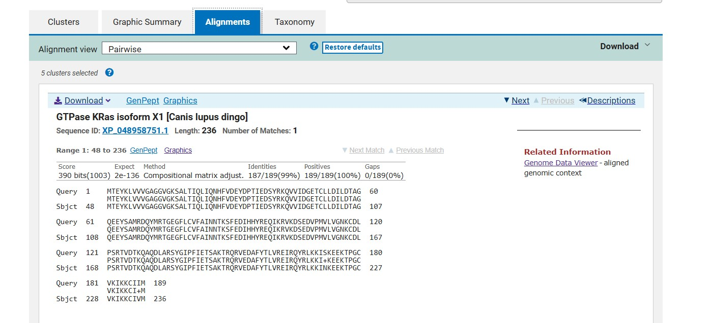
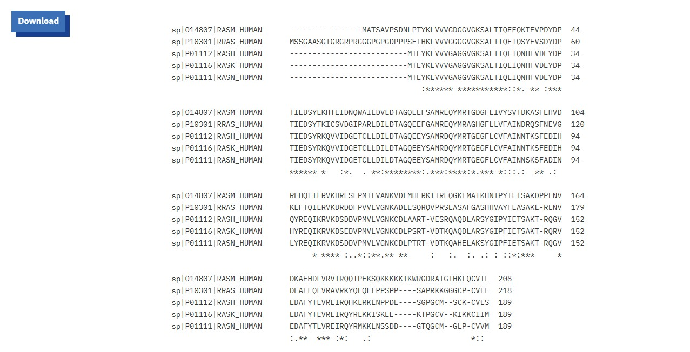
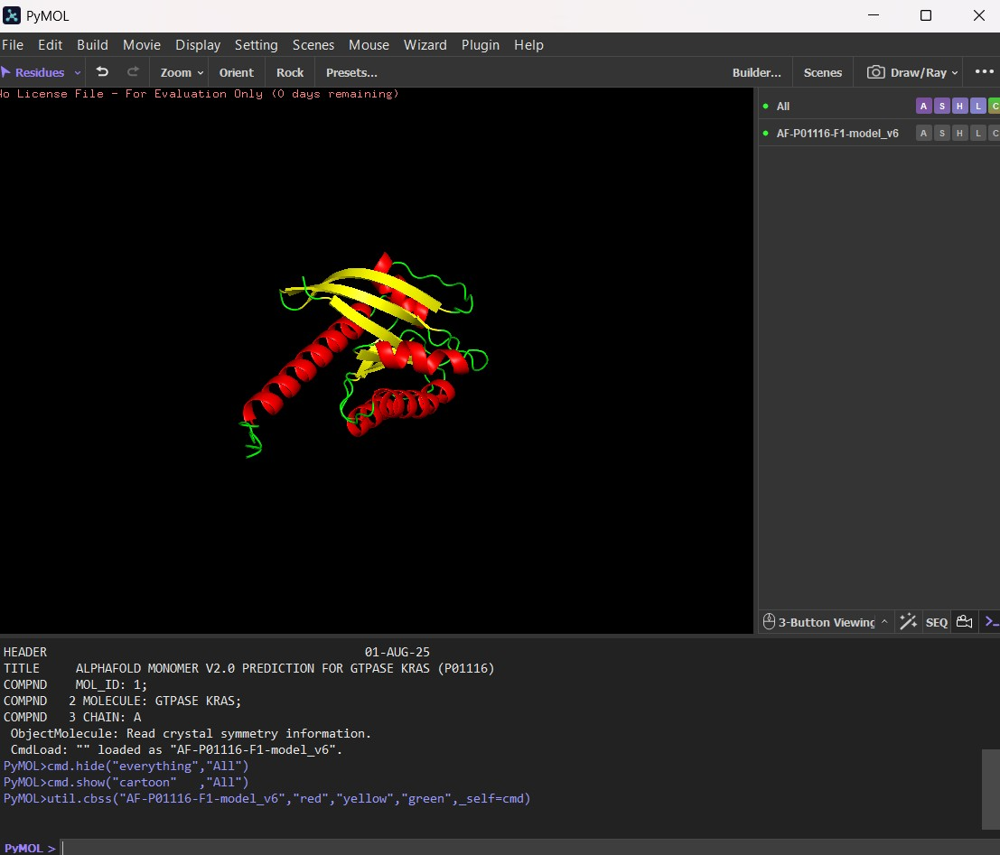
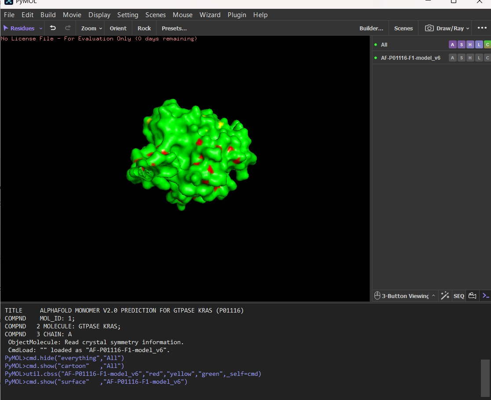

# Bioinformatics Analysis of Human KRAS and Ras-Family Homologs

This repository contains a comprehensive sequence and structural analysis of human KRAS (`P01116`) and related Ras-family proteins[cite: 1, 2, 3, 4]. The study integrates sequence homology search using **BLASTP**, multiple sequence alignment via **Clustal Omega**, and 3D structural modeling using **PyMOL**[cite: 1, 2, 3, 4].

---

## 📌 Project Overview

| Task | Analysis Type | Core Tool / Database | Key Focus |
| :--- | :--- | :--- | :--- |
| **Task 1** | BLASTP Homology Search | NCBI BLASTP / UniProt | Evolutionary conservation, E-value, Bit scores, % Identity[cite: 1, 4] |
| **Task 2** | Multiple Sequence Alignment | EMBL-EBI Clustal Omega | Conserved motifs (P-loop, Switch regions, HVR)[cite: 1, 3] |
| **Task 3** | Structure Prediction & Visualization | PyMOL / AlphaFold DB | 3D Secondary structure cartoons & molecular surface[cite: 1, 2] |

---

## Task 1: DNA/Protein Sequence Analysis (BLASTP)

### Aim
To identify homologous proteins of human KRAS using BLASTP, evaluate sequence conservation across related species, and analyze percentage identity, query coverage, E-value, and alignment scores for key functional domains[cite: 1, 4].

### Introduction
The human *KRAS* gene encodes a small GTPase belonging to the Ras protein family, functioning as a molecular switch in the Ras-MAPK signaling cascade to regulate cell proliferation, differentiation, and survival[cite: 1, 4]. The canonical human KRAS protein comprises 189 amino acids and features a highly conserved N-terminal GTPase catalytic domain alongside a variable C-terminal hypervariable region (HVR) responsible for membrane targeting[cite: 1, 4].

BLASTP aligns a query protein sequence against a target database using heuristic algorithms to detect statistically significant sequence similarities[cite: 1, 4]. Analyzing parameters such as Bit score, E-value, percent identity, and conservative substitutions allows for the identification of functionally indispensable motifs, including the phosphate-binding loop (P-loop) and switch regions critical for GTP hydrolysis[cite: 1, 4].

### Top BLASTP Hits
| Hit | Protein Description | Accession | Max Score | Total Score | Query Cover | E-value | Percent Identity |
| :---: | :--- | :---: | :---: | :---: | :---: | :---: | :---: |
| **1** | GTPase KRas isoform X1 [*Canis lupus dingo*] | `XP_048958751.1` | 390 | 390 | 100% | $2 \times 10^{-136}$ | 98.94%[cite: 1, 4] |
| **2** | GTPase KRas isoform X4 [*Canis lupus dingo*] | `XP_048958756.1` | 391 | 391 | 100% | $2 \times 10^{-136}$ | 98.94%[cite: 1, 4] |
| **3** | Unnamed protein product, partial [*Ovis aries*] | `VCX04206.1` | 390 | 390 | 100% | $6 \times 10^{-136}$ | 98.94%[cite: 1, 4] |
| **4** | UBE2L3/KRAS fusion protein [*Homo sapiens*] | `AEA35014.1` | 391 | 391 | 100% | $1 \times 10^{-135}$ | 100.00%[cite: 1, 4] |

### Interpretation
The BLASTP analysis revealed exceptionally high sequence conservation for human KRAS across mammalian homologs[cite: 1, 4]. The top alignment (*Canis lupus dingo*, $98.94\%$ identity, $E\text{-value} = 2 \times 10^{-136}$) demonstrates $100\%$ identity across the primary catalytic GTPase domain (residues 1–120), preserving the critical P-loop motif (`GAGGVGKS`) responsible for nucleotide binding[cite: 1, 4]. Minor conservative amino acid substitutions were restricted strictly to the C-terminal hypervariable region, reflecting evolutionary tolerance for variation in non-catalytic membrane-anchoring zones while keeping the enzymatic core invariant[cite: 1, 4].

### Conclusion
BLASTP successfully identified close homologs of human KRAS[cite: 1, 4]. The extreme sequence conservation—evidenced by high Bit scores and near-zero E-values—underscores the strong evolutionary constraint on the GTPase domain necessary for maintaining vital intracellular MAPK signaling pathways[cite: 1, 4].

---

## Task 2: Multiple Sequence Alignment of Ras-Family Proteins

### Aim
To perform multiple sequence alignment of five human Ras-family proteins using Clustal Omega, identify conserved regions and functional motifs, and evaluate sequence variation across the family[cite: 1, 3].

### Introduction
Multiple Sequence Alignment (MSA) aligns three or more biological sequences to identify conserved residues, evolutionary relationships, and critical structural or functional motifs[cite: 1, 3]. Ras-family small GTPases operate as molecular switches in intracellular signal transduction pathways, controlling cell growth, differentiation, and survival[cite: 1, 3]. Aligning canonical human KRAS against four related Ras-family proteins (HRAS, NRAS, RRAS, and MRAS) highlights highly conserved catalytic domains along with variable regulatory regions[cite: 1, 3].

### Input Sequences
| No. | Protein Name | Gene | Organism | Accession ID | Length |
| :---: | :--- | :---: | :---: | :---: | :---: |
| **1** | GTPase KRas | *KRAS* | *Homo sapiens* | `P01116` | 189 aa[cite: 1, 3] |
| **2** | GTPase HRas | *HRAS* | *Homo sapiens* | `P01112` | 189 aa[cite: 1, 3] |
| **3** | GTPase NRas | *NRAS* | *Homo sapiens* | `P01111` | 189 aa[cite: 1, 3] |
| **4** | Ras-related protein R-Ras | *RRAS* | *Homo sapiens* | `P10301` | 218 aa[cite: 1, 3] |
| **5** | Ras-related protein M-Ras | *MRAS* | *Homo sapiens* | `O14807` | 208 aa[cite: 1, 3] |

### Conserved Motif Analysis
* **P-Loop / GTP-Binding Motif:** Near the N-terminal region, the conserved consensus sequence `GxxxxGKS` (specifically `GAGGVGKS`, residues 10–17 in KRAS) shows complete conservation (`*`) across all five Ras-family proteins[cite: 1, 3].
* **Switch Regions:** Residues within the catalytic core containing the `DTAG` motif (residues 57–60 in KRAS) remain strictly conserved, maintaining essential coordinates for $\text{Mg}^{2+}$ coordination and GTP hydrolysis[cite: 1, 3].
* **Hypervariable Region (HVR):** Significant sequence variation and length differences occur toward the C-terminal tails (residues 166–189 in KRAS), which dictate distinct membrane localization and lipid modification profiles[cite: 1, 3].

### Interpretation
The multiple sequence alignment demonstrates substantial sequence conservation among the five human Ras-family proteins, particularly within the N-terminal GTPase domain (residues 1–120)[cite: 1, 3]. The strict conservation of the consensus P-loop motif (`GAGGVGKS`) highlights its indispensable role in binding the phosphate groups of GDP and GTP[cite: 1, 3]. High sequence conservation across Switch I and Switch II loops further confirms a shared mechanism for effector binding and signal transmission[cite: 1, 3].

### Conclusion
Clustal Omega MSA confirmed strong evolutionary conservation across the catalytic core of human Ras-family proteins[cite: 1, 3]. The strict preservation of the GTP-binding P-loop motif (`GxxxxGKS`) and catalytic switch regions supports their shared evolutionary lineage and conserved molecular function as GTPase switches[cite: 1, 3].

---

## Task 3: Protein Structure Prediction & Visualization (PyMOL)

### Aim
To predict, model, and visualize the three-dimensional tertiary structure of human KRAS protein using computational tools and analyze key structural features in PyMOL[cite: 1, 2].

### Introduction
Understanding the three-dimensional structure of a protein is essential for deciphering its biological mechanism, atomic interactions, and functional sites[cite: 1, 2]. Human KRAS is a small GTPase consisting of 189 amino acids that cycles between active (GTP-bound) and inactive (GDP-bound) states[cite: 1, 2]. Visualizing these structures using molecular graphics software like PyMOL permits clear identification of structural elements, including the central $\beta$-sheet core, amphipathic $\alpha$-helices, flexible switch loops, and the catalytic GTP-binding pocket[cite: 1, 2].

### Structural Visualizations

| Cartoon Representation | Surface Representation |
| :---: | :---: |
|  |  |
| *Secondary Structure Cartoon ($\alpha$-helices in red, $\beta$-sheets in yellow, loops in green)*[cite: 1, 2] | *Molecular Solvent-Accessible Surface Topography*[cite: 1, 2] |

### Interpretation
The 3D structural model of human KRAS clearly illustrates the spatial arrangement necessary for its role as a molecular switch[cite: 1, 2]. The central $\beta$-sheet provides a stable framework, while the P-loop forms a precise binding pocket for guanine nucleotides[cite: 1, 2]. The surface topology demonstrates how the active site cleft accommodates the phosphate tail of GTP, while Switch I and Switch II surround the pocket to adopt distinct conformations during signal transmission[cite: 1, 2].

### Conclusion
Three-dimensional visualization of human KRAS in PyMOL revealed a highly structured $\alpha/\beta$ domain optimized for nucleotide binding and catalysis[cite: 1, 2]. Identifying the P-loop and flexible switch regions highlights the structural basis of Ras GTPase signal transduction[cite: 1, 2].
